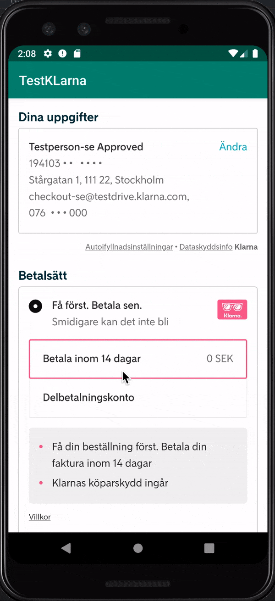

# App for testing klarna-sdk implementation

## Usage
1. Save your html snippet (Klarna Checkout HTML snippet from your web server) as a snippet.html file and place it into the folder `src/main/assets`.
2. Run the app.

## Current status

Scroll not working on device:

While working on emulator:

